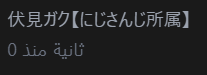

# FusionTube

プライバシー重視のYouTubeデスクトップクライアント。動画視聴・ダウンロード・AI要約を1つに統合。



## 特徴

- **プライバシー保護** - Invidious経由でYouTubeにアクセス。Googleへの直接通信なし
- **1000+サイト対応ダウンロード** - yt-dlp搭載。YouTube、ニコニコ、X、TikTok、Instagram等
- **AI動画要約** - Gemini / Claude / GPT で字幕から要約を自動生成
- **SponsorBlock** - スポンサー・イントロ・アウトロを自動スキップ
- **高速ダウンロード** - aria2c統合で3〜5倍の速度（16並列接続）
- **AIプレイリスト生成** - 視聴履歴と動画内容からAIがプレイリストを自動作成

## 機能一覧

### 動画再生

| 機能 | 詳細 |
|------|------|
| HLS対応 | ライブ配信のHLSストリーム再生 |
| 再生速度 | 0.07x〜16x（17段階プリセット + 微調整） |
| 音量ブースト | Web Audio APIで最大10倍増幅 |
| マウスホイール操作 | 音量・再生速度をホイールで調整 |
| チャプター | 動画チャプターのナビゲーション |
| スクリーンショット | 再生中フレームのキャプチャ |

### ダウンロード

| 機能 | 詳細 |
|------|------|
| 対応フォーマット | MP4 / MKV / WebM / MP3 / OPUS / FLAC |
| 画質選択 | Best / 1080p / 720p / 480p / 音声のみ |
| サムネイル埋め込み | ダウンロードファイルにサムネイルを自動埋め込み |
| 字幕埋め込み | 字幕をファイルに埋め込み |
| 同時ダウンロード | 1〜10本の並行ダウンロード |
| Fast Mode | aria2c外部ダウンローダー（16並列接続） |
| カスタム引数 | yt-dlpの任意オプション指定 |

### AI機能

| 機能 | 詳細 |
|------|------|
| 動画要約 | 字幕を解析してMarkdown形式の要約を生成 |
| プレイリスト生成 | 視聴中の動画+履歴からAIが関連動画を検索・プレイリスト化 |
| 対応モデル | Gemini (3-flash/3-pro/2.5-flash)、Claude (sonnet/opus/haiku)、GPT (5.2/4o) |

### コンテンツ管理

- **検索** - ソート（関連度/日付/再生回数/評価）、日付フィルター
- **購読** - チャンネル登録、フィード集約、OPMLエクスポート
- **プレイリスト** - YouTubeアカウント / URL追加 / ローカル（AI生成含む）の3種
- **視聴履歴** - タイムスタンプ付き記録
- **あとで見る** - ブックマーク機能
- **トレンド** - 地域別（日本/米国/英国/韓国）トレンド動画

### プライバシー・セキュリティ

- **Invidiousプロキシ** - YouTubeリクエストをプライバシーインスタンス経由
- **SOCKS5プロキシ** - オプションのグローバルプロキシ対応
- **Cookie認証** - YouTubeセッションをcookies.txtで永続化
- **ブラウザCookie自動取得** - Edge / Chrome / Firefox / Brave対応
- **DeArrow** - コミュニティ改善サムネイル・タイトル

## インストール

### ダウンロード

[Releases](https://github.com/YOUR_GITHUB_USERNAME/fusiontube/releases)から最新版をダウンロード:

- **FusionTube x.x.x.exe** - ポータブル版（インストール不要）
- **FusionTube Setup x.x.x.exe** - インストーラー版

### 必要環境

- Windows 10/11 (x64)

## 開発

### セットアップ

```bash
git clone https://github.com/YOUR_GITHUB_USERNAME/fusiontube.git
cd fusiontube
npm install
```

### 開発サーバー

```bash
npm run dev
```

### ビルド

```bash
# electron-vite ビルド
npm run build

# Windows向けパッケージング（ポータブル + インストーラー）
npm run package:win
```

### 技術スタック

| レイヤー | 技術 |
|---------|------|
| デスクトップ | Electron 34 |
| フロントエンド | Vue 3 + TypeScript |
| 状態管理 | Pinia |
| スタイリング | Tailwind CSS |
| ビルドツール | electron-vite |
| 動画ストリーミング | HLS.js |
| 動画ダウンロード | yt-dlp, aria2c |
| コンテンツAPI | Invidious, YouTube InnerTube, YouTube Data API |
| AI API | Google Gemini, Anthropic Claude, OpenAI GPT |

### プロジェクト構成

```
src/
├── main/               # Electronメインプロセス
│   ├── index.ts        # ウィンドウ管理、IPC登録
│   ├── ipc/            # IPCハンドラー
│   │   ├── youtube.ts  # YouTube API（検索/動画/チャンネル/トレンド）
│   │   ├── download.ts # ダウンロード管理（yt-dlp/aria2c）
│   │   ├── ai.ts       # AI要約・プレイリスト生成
│   │   └── sponsorblock.ts
│   └── store/
│       └── settings.ts # 設定の永続化
├── preload/            # プリロードスクリプト
│   └── index.ts        # API公開（contextBridge）
└── renderer/           # Vue.jsフロントエンド
    └── src/
        ├── components/ # UIコンポーネント
        ├── views/      # ページコンポーネント
        ├── stores/     # Piniaストア
        └── router/     # ルーティング
```

## キーボードショートカット

| キー | 操作 |
|-----|------|
| `Space` | 再生/一時停止 |
| `←` / `→` | 5秒戻る/進む |
| `F` | フルスクリーン |
| `M` | ミュート |
| `Ctrl+D` | ダウンロード |
| `Ctrl+Wheel` | 再生速度変更 |
| `Wheel` | 音量変更 |

## ライセンス

MIT
